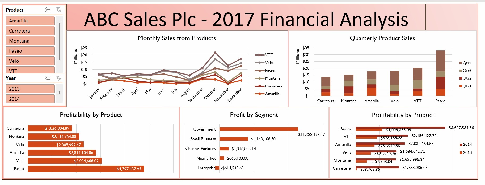

# 📊 2017 Financial Performance Analysis Dashboard

## 🔍 Project Overview
This project focuses on building an **interactive financial analysis dashboard** to evaluate the **sales performance, profitability, and segment contribution** of **ABC Sales Plc** across multiple products and time periods.

The dashboard helps stakeholders quickly identify trends, compare product performance, and understand key profitability drivers to support informed, data-driven decisions.

---

## 🎯 Project Objectives
The key objectives of this project were to:

- Analyze **monthly and quarterly sales trends** across all products  
- Compare **profitability by product and business segment**  
- Identify **top-performing and underperforming products**  
- Enable **year-over-year performance comparison**  
- Deliver an **executive-ready, interactive dashboard** for financial insights  

---

## 🛠️ Tools & Technologies Used
- **Microsoft Excel**
  - Pivot Tables & Pivot Charts  
  - Slicers (Product & Year)  
  - Data modeling & aggregation  
- **Data Visualization**
  - Line charts  
  - Stacked column charts  
  - Bar charts  
- **Financial Analysis Techniques**
  - Trend analysis  
  - Product and segment profitability analysis  

---

## 🧩 Dataset Description
The dataset contains sales and profit data segmented by:

- **Product:** Amarilla, Carretera, Montana, Paseo, Velo, VTT  
- **Time Period:** Monthly, Quarterly, Yearly  
- **Business Segment:** Government, Small Business, Midmarket, Enterprise, Channel Partners  
- **Metrics:** Revenue and Profit  

---

## 🔄 Project Workflow

### 1. Data Cleaning & Preparation
- Reviewed raw financial data for accuracy and consistency  
- Ensured correct date formats and numeric fields  
- Standardized product and segment naming  

### 2. Data Modeling
Created pivot tables to aggregate:
- Monthly sales by product  
- Quarterly sales by product  
- Profitability by product  
- Profit contribution by customer segment  

### 3. Dashboard Design
- Designed a **single-page executive dashboard**  
- Applied consistent color themes and layout  
- Implemented slicers for **Product** and **Year** filtering  
- Ensured visuals were intuitive for non-technical users  

### 4. Visualization & Interactivity
- Line chart for **monthly sales trends**  
- Stacked column chart for **quarterly product sales**  
- Bar charts for **profitability comparisons**  
- Interactive slicers for dynamic insights  

---

## 📈 Key Results & Insights

### 🔹 Sales Trends
- **October and December** showed notable sales peaks  
- **VTT and Paseo** consistently recorded higher sales volumes  
- Some products experienced **mid-year seasonal dips**

### 🔹 Product Profitability
- **Paseo** emerged as the most profitable product  
- **VTT and Amarilla** followed closely  
- **Carretera** showed relatively lower profitability  

### 🔹 Segment Performance
- **Government segment** contributed the highest share of profit  
- **Small Business and Channel Partners** showed moderate performance  
- **Enterprise segment** recorded the lowest profit, suggesting pricing or cost challenges  

### 🔹 Year-on-Year Performance
- Most products showed **profit growth from 2013 to 2014**  
- Indicates improving cost efficiency and stronger pricing strategies  

---

## 💡 Recommendations
- **Focus on High-Performing Products:** Increase investment in *Paseo* and *VTT*  
- **Optimize Low-Performing Products:** Reassess pricing and cost structure for *Carretera*  
- **Strengthen Government & SMB Segments:** Expand tailored offerings  
- **Address Enterprise Segment Decline:** Review contracts, pricing, and engagement strategy  
- **Leverage Seasonality:** Plan promotions and inventory ahead of Q4 peak periods  

---

## 📌 Business Impact
This dashboard enables:
- Faster access to **key financial insights**  
- Improved **data-driven decision-making**  
- Clear visibility into **profit drivers and risks**  
- A reusable framework for **future financial reporting and analysis**  

---

## 🚀 Skills Demonstrated
- Financial and business analysis  
- Data visualization and storytelling  
- Executive dashboard design  
- Excel data modeling and interactivity  
- Translating data into actionable business insights  

---

📁 *This project is part of my data analytics portfolio showcasing practical business intelligence and financial analysis skills.*
